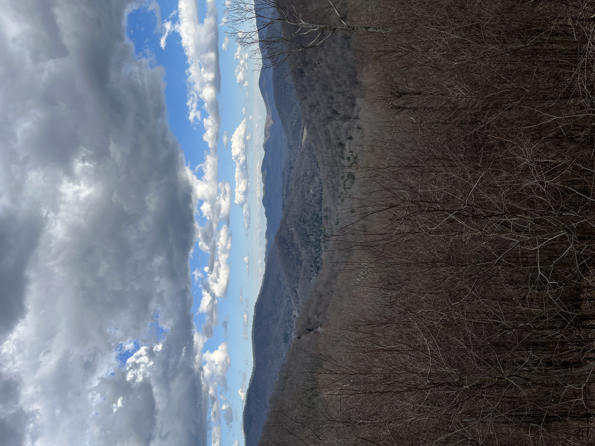

import Table from '../src/components/Table/Table.jsx';

Sorry for the delay on getting this update posted. I got back late Sunday night from some much needed R&R in Asheville, North Carolina, where I spent an awesome weekend celebrating a friend’s bachelor party. Here’s a view from our cabin on top of Black Mountain:

## New PR Rules for DOCS Repo
This week we updated the GitHub rules for merging PRs in the DOCS repo. Previously any individual could merge a PR without any reviews. With the changes it now requires one approval for any merges into the `main` branch. This is common on most projects and provides an opportunity to enforce coding standards we well as preventing random merges that could negatively impact the code base. 

If you ever need to do this to a repo that you own here are some simple instructions for adding rules to a repository:

[Managing a branch protection rule - GitHub Docs](
https://docs.github.com/en/repositories/configuring-branches-and-merges-in-your-repository/defining-the-mergeability-of-pull-requests/managing-a-branch-protection-rule)

## Application Updates

We continue to make progress with the DOCS site. Special shoutout to Will C. and Pedro for their merged PRs!

Here's the week in numbers:

<Table header={['Merged PRs', 'Issues Added', 'Issues Closed']} body={[4,0,4]} />

(Huge shoutout to Pedro who put this awesome `<Table />` component together! It looks great!)

## The Week Ahead
This week we will continue our efforts in the DOCS repo. I’ll continue adding stories related to the `Project Overview` section and will update Slack as new issues are added. 

Here are some current open issues: 

- [Issue #21](https://github.com/wijohnst/thriving-park-documentation/issues/21) - Update `Sidebar` to show `Project Overview` items in correct order
- [Issue #23](https://github.com/wijohnst/thriving-park-documentation/issues/23) - Refactor `<ParkSign />` component to be reactive 

Additionally, I really want to release the `Product Roadmap` this week to help prioritize work moving forward. 

## Final Thoughts
It was awesome to have some time away from work but I’m so excited to get back to our mission! As always, thanks to everyone who contributed this week. Now let’s go crush another one!

-Will 
