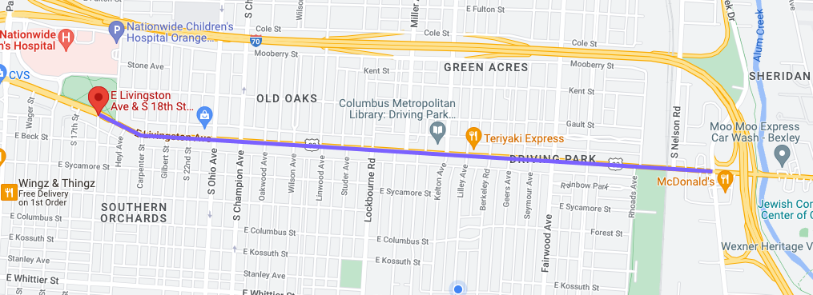

import Table from '../src/components/Table/Table.jsx';

Another week another (semi) weekly update...  Keep reading for all the week's ThrivingPark news!

## Congratulations Nasir!
Huge congratulations to Nasir, who has been hired as an engineer with Shopsmith out of Dayton where he will be working on their e-commerce applications. Nasir was the first pre-career engineer to join ThrivingPark and his contributions and enthusiasm have helped shape this project from the very first days. His new employer is lucky to have him and we wish him good luck as he starts this exciting new chapter in his career! (And we hope this means he can work less late nights!) 

## New Team Member
Matt Kitchens is a self-taught engineer who is currently working through the FCC JavaScript curriculum. Matt and I met at a tech talk about microservices a few weeks ago. While the talk was pretty bad it was awesome to meet another passionate developer who is looking to up-skill while giving back. If you haven’t, please shoot Matt a hello in Slack!

## Livingston Avenue Corridor Improvements Committee x ThrivingPark 
This week I had the pleasure of attending a Driving Park community meeting regarding the beautification efforts on Livingston Avenue, which is a part of the wider Livingston Avenue Corridor Improvements project.  In the [Joint Livingston Avenue Plan](https://bexley.org/livingston/#:~:text=Joint%20Livingston-,Avenue%20Plan,residents%20of%20all%20surrounding%20communities.), Columbus city official describes the effort as:

> *“[A] project to identify opportunities for improvements to the Livingston corridor that benefits the residents of all surrounding communities.”*

_Pictured, Livingston Avenue from 18th Street to Alumn Creek Drive, the proposed site for beautification efforts_

The Driving Park portion of the larger Livingston Area Improvements Plan is being over-seen by the [Gertrude Wood Community Foundation](https://www.gwoodfoundation.com/), a Driving Park non-profit dedicated to “[providing] opportunities that strengthen the Driving Park community". ThrivingPark will be providing technical support to the Housing Committee in the form of custom web tooling for data collection and persistence. This will be a great opportunity to diversify our work from the main ThrivingPark application and learn some new technologies. Details are still being hashed out and I'll update the team as I learn more. 

## Application Updates
Another great effort this week team! Special shoutout to Jessica for completing the `Shape` stories in the main front end repo. Completing `Shape` introduces about a half-dozen new technologies and concepts, so tackling that is not small feat. 

<Table header={['Merged PRs', 'Open PRs', 'Issues Added', 'Issues Closed']} body={[1,2,4,2]} />

## The Coming Week
We have plenty of open issues that need volunteers for the upcoming week. If you’re interested please check out the [issues tab](https://github.com/wijohnst/thriving-park/issues) in the frontend repo for details. I will be holding Office Hours on Sunday (5/15) from 10 - Noon. As a reminder Office Hours is a chance to catch up and to work through any questions that you may have about project work (or dev stuff in general). We can also use that time for pair coding, which is a great way to super-charge your learning. 

Looking forward to another great week in Thriving Park!
-Will 
